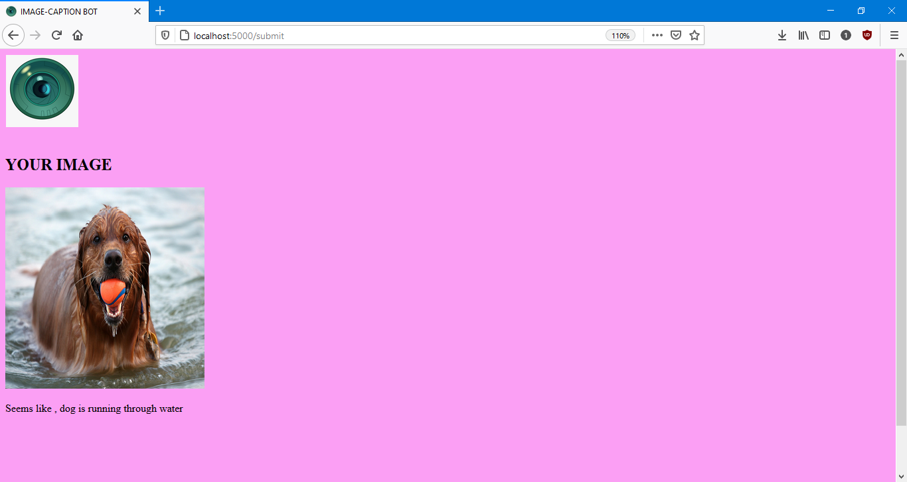

# Image Caption Bot
## Keras model for caption on images deployed on a flask server
Made as a project under coding blocks machine learning course(2020). 

## Dataset Used
The model was train on [Flickr-8k dataset](https://www.kaggle.com/shadabhussain/flickr8k). 
* It consist of total 8000 images taken from flickr database.
* Dataset is divided into training, validation and test set containg 6000,1000 and 1000 samples respectively.

## Model Architecture
Overall the model consist of [Resnet-50](https://keras.io/api/applications/resnet/#resnet50-function) convolutional base and a LSTM layer using containg [glove6B-50d](https://nlp.stanford.edu/projects/glove/) embedding as its weights. The output from both layers are conbined in MLP network (with softmax activation) which gives us probability distribution for next word in the sequence.  

### Model Parameters

### Model Flowchart

## Training
The model is trained for 50 epochs using **categorical cross entropy** loss function and **Adam** optimizer. 
For first 30 epochs model is trained with batch size=3 and learning rate= 0.001. For last 20 epoches batch size is increased to 6 and learning rate is reduced to 0.0001.  

## Flask Web Applocation Layout
### Homepage

### Result page

## Caption Predicted by the model

